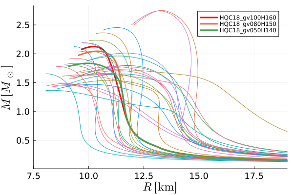
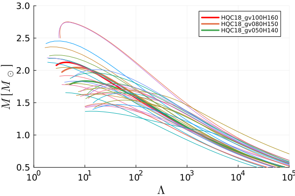
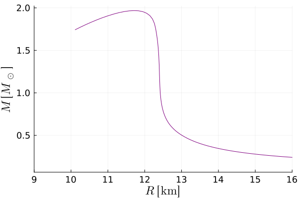

# Tolman–Oppenheimer–Volkoff Equation Solver in Julia

## Overview

This project provides a Julia implementation for solving the Tolman–Oppenheimer–Volkoff (TOV) equations.
It uses equation of state (EoS) to model compact stars (e.g. neutron star, quark star) and calculates their mass, radius, and tidal deformability (cf. the [PiecewisePolytrope_test.ipynb](PiecewisePolytrope_test.ipynb)).
Input EoS should be in the geometrized unit system, where distances are expressed in centimeters [cm].
If the energy_density and pressure are given in [g/cm^3] unit, the inputs of the 'MainModule' should be energy_density/unit_g and pressure/unit_g [1/cm^3].
In addition, this project includes the Julia code to generate a piecewise polytrope EoS for a given parameters.
  
  
  

## Files and Modules

### 1. `main.jl`
- **Purpose**: Acts as the main entry point for calculations.
- **Key Functions**:
  - `make_eos_monotonic(e, P)`: Processes energy density (`e`) and pressure (`P`) arrays to ensure monotonicity by removing non-physical regions.
  - `out_RMT(ε, pres; ...)`: Solves the TOV equations to compute radius, mass, and tidal deformability for given energy densities  (`ε`) [1/cm^3] and pressures (`pres`) [1/cm^3].
- **Dependencies**: 
  - `solver_code.jl` for solving the TOV equations.

### 2. `solver_code.jl`
- **Purpose**: Contains the numerical solvers and tools to compute stellar properties.
- **Key Functions**:
  - `Debug(input_list; base_filename)`: Logs data for debugging.
  - `tidal_deformability(y, M, R)`: Computes tidal deformability given dimensionless compactness and stellar properties.
  - `solveTOV_RMT(center_idx, ε, pres, debug_flag)`: Solves the TOV equations for a given central density [1/cm^3] and pressure [1/cm^3] using an ODE solver.
  - `TOV_def!(...)`: Defines the TOV differential equations.
- **Dependencies**: Relies on `DifferentialEquations.jl` for ODE solving.

### 3. `piecewise_polytrope_eos_cgs.jl`
- **Purpose**: Implements the piecewise polytropic EoS framework in the CGS unit system!
- **Key Features**:
  - Defines fixed crust parameters for the EoS.
  - Provides functions to calculate pressure [g/cm^3], energy density [g/cm^3], and polytropic constants for different density segments.
- **Key Functions**:
  - `get_all_params(log_p1, Gamma; p_c=fixed_crust)`: Computes all parameters required to describe the equations of state.
  - `make_polyEos(rho_lim_arr, a_arr, ...)`: Constructs energy density and pressure arrays for the entire density range.

### 4. `constants.jl`
- **Purpose**: Contains physical and conversion constants used throughout the code.

## Usage

### Prerequisites
- Julia version 1.6 or higher.
- Install required Julia packages:
  ```julia
  using Pkg
  Pkg.add(["DifferentialEquations", "Dates"])
  ```

### Running the Code
1. Include the necessary modules in your Julia environment:
   ```julia
   include("main.jl")
   using .MainModule
   ```
2. Prepare energy density and pressure data (geometrized unit system, where distances are expressed in centimeters [cm]).
   If energy_density and pressure are given in [g/cm^3] unit, the inputs shoulds be energy_density/unit_g and pressure/unit_g [1/cm^3]:
   ```julia
   mono_e, mono_pres = MainModule.make_eos_monotonic(energy_density, pressure)
   ```
   
3. Call `out_RMT` to calculate stellar properties:
   ```julia
   RMT, solution = MainModule.out_RMT(mono_e/unit_g, mono_pres/unit_g)
   ```
   
   
4. Plot results (cf. the [PiecewisePolytrope_test.ipynb](PiecewisePolytrope_test.ipynb)):

## Key Concepts

### 1. Tolman–Oppenheimer–Volkoff (TOV) Equations
The TOV equations describe the structure of a spherically symmetric star in hydrostatic equilibrium, accounting for general relativity.

### 2. Piecewise Polytropic EoS
The piecewise polytropic model approximates the neutron star EoS by dividing it into segments, each described by a polytropic relation:
\[ P(\rho) = K \rho^\Gamma \]

### 3. Tidal Deformability
Tidal deformability quantifies how easily a compact star deforms under an external gravitational field, crucial for gravitational wave studies.

## References
- T. Hinderer, B. D. Lackey, R. N. Lang and J. S. Read, Phys. Rev. D 81, 123016 (2010)
doi:10.1103/PhysRevD.81.123016 [arXiv:0911.3535 [astro-ph.HE]].
- J. S. Read, B. D. Lackey, B. J. Owen and J. L. Friedman, Phys. Rev. D 79, 124032 (2009)
doi:10.1103/PhysRevD.79.124032 [arXiv:0812.2163 [astro-ph]].
- Y. Fujimoto, K. Fukushima, K. Hotokezaka and K. Kyutoku, Phys. Rev. Lett. 130, no.9, 091404 (2023)
doi:10.1103/PhysRevLett.130.091404 [arXiv:2205.03882 [astro-ph.HE]].
- G. Baym, T. Hatsuda, T. Kojo, P. D. Powell, Y. Song and T. Takatsuka, Rept. Prog. Phys. 81, no.5,
056902 (2018) doi:10.1088/1361-6633/aaae14 [arXiv:1707.04966 [astro-ph.HE]].
## Contributing
Feel free to submit issues or pull requests to improve this project.

## License
This project is licensed under the MIT License. See the LICENSE file for details.
